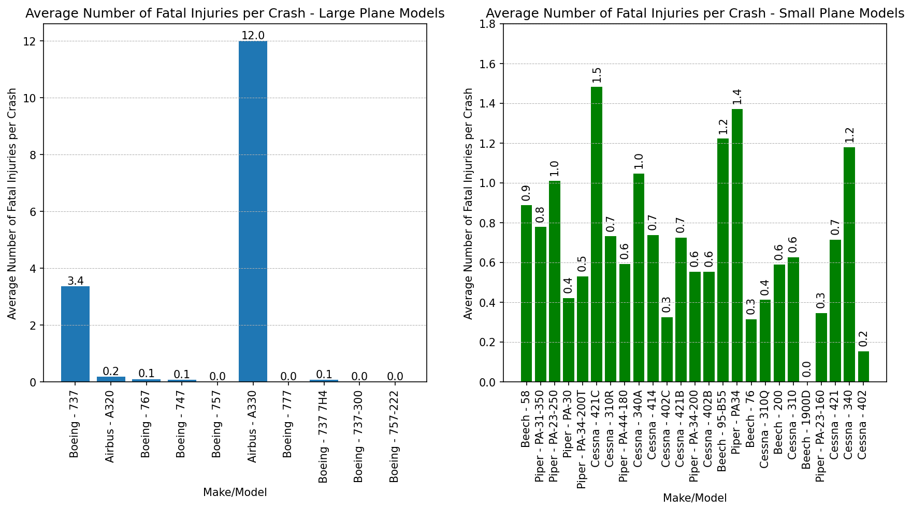
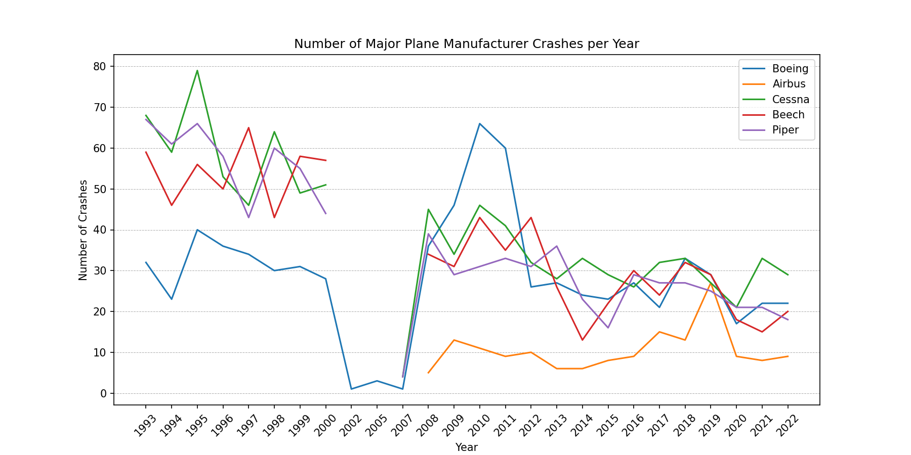

# Aviation Accident Analysis

by Michael Kearns

# Business Understanding

The company is planning to purchase airplanes to expand the business and begin operating commercial and private flights. The Head of Aviation wants to know which airplanes are the lowest risk for the company to purchase. My analysis will help them determine which manufacturers and models have the lowest fatality rates from the past 30 years. After my recommendations, the Head of Aviation plans to determine the costs of purchasing and maintaining these airplanes.

# Data Understanding

The dataset is from the National Transportation Safety Board. It includes civil aviation accidents and other selected incidents from 1962 to 2023. This step is focused on understanding what is in the dataset so it can be further analyzed to answer the business question.

Each record of this dataset represents an aviation accident, marked by the "Event ID", with information about the plane (make, model, etc.) and the severity of the accident (# of injuries). This information is useful to determine which airplane manufacturers and models have the lowest fatality rates.

## Data Preparation

The data set needs to be cleaned and organized so that the analysis will produce clear and accurate results. 

The "Make" column needs to be normalized so there are no repeat values with different formats. Less than 15% of the injury data is missing, therefore those rows can be removed. There do not appear to be any extraneous values that are used to represent missing data. 

The dataset includes incidents from 60 years ago, but this date range is too far back. Accidents from the '60s and '70s are interesting to know, but planes built over 30 years ago will not be purchased. The dataset will be sorted from the past 30 years to better understand the safety of current planes. Additional columns will be created to help filter data for analysis, such as "Year" and "Make/Model".

# Exploratory Data Analysis

In the past 60 years, 85% of airplane crashes include airplanes with a single engine. Only airplanes with at least two engines should be considered to determine the safest aircraft.

The following figure shows the airplane makes/models with the highest number of incidents in the past 30 years among large airplanes (passenger capacity over 100) and small airplanes (passenger capacity < 20), and their respective average number of fatal injuries.

The number of crashes among major manufacturers has generally decreased over the past 30 years. Note that either no incidents occurred or were reported between the years 2000-2008.

## Tableau Dashboard

Please refer to my [interactive dashboard] (https://public.tableau.com/views/AviationAccientsAnalysis/AviationAccidentAnalysisDashboard?:language=en-US&publish=yes&:sid=&:display_count=n&:origin=viz_share_link) "Aviation Accidents Dashboard" for more visualizations.

# Conclusion and Recommendations

The analysis leads to the following three recommendations for the Head of Aviation:

  1) Since 1923, approximately 85% of airplane accidents are planes with single engines. To ensure the most safety, planes with **at least 2 engines** should be considered. 
  3)  The **Boeing 757** or **Airbus A319** should be considered if the company plans to operate large commercial flights with over 100 passengers. These two models have had zero deaths in the past 30 years.
      If the company plans to operate flights with fewer than 20 passengers, the **Beech 1900D** and **Cessna 402** should be considered. They have the lowest fatality rates in the past 30 years among small plane models. 
  5) The number of plane crashes per year is trending down. This is expected to continue, therefore **safety reviews** of the company's fleet should be conducted **every 10 years** to ensure they own and operate the safest planes on the market.
     
## Next Steps

Additional analysis can be conducted to assist the Head of Aviation. I believe the following questions should be considered next:

* What are the financial costs of owning/operating these planes? What are the maintenance costs? What is the profitability of this business?
* Where should our planes be operated? Are there specific airports and locations that we will fly to to reduce the possibility of crashes?
